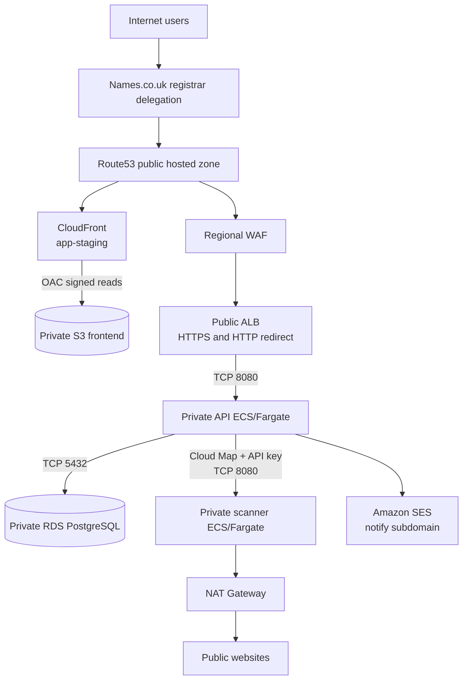
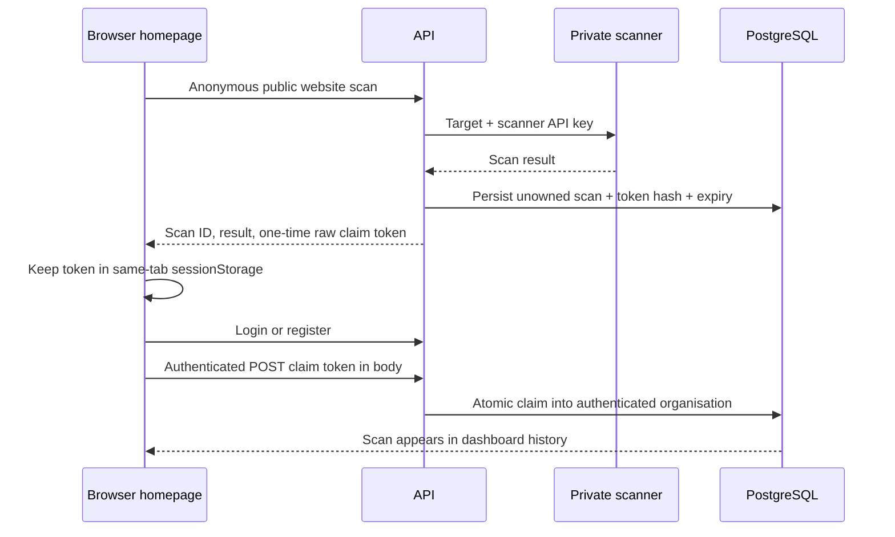
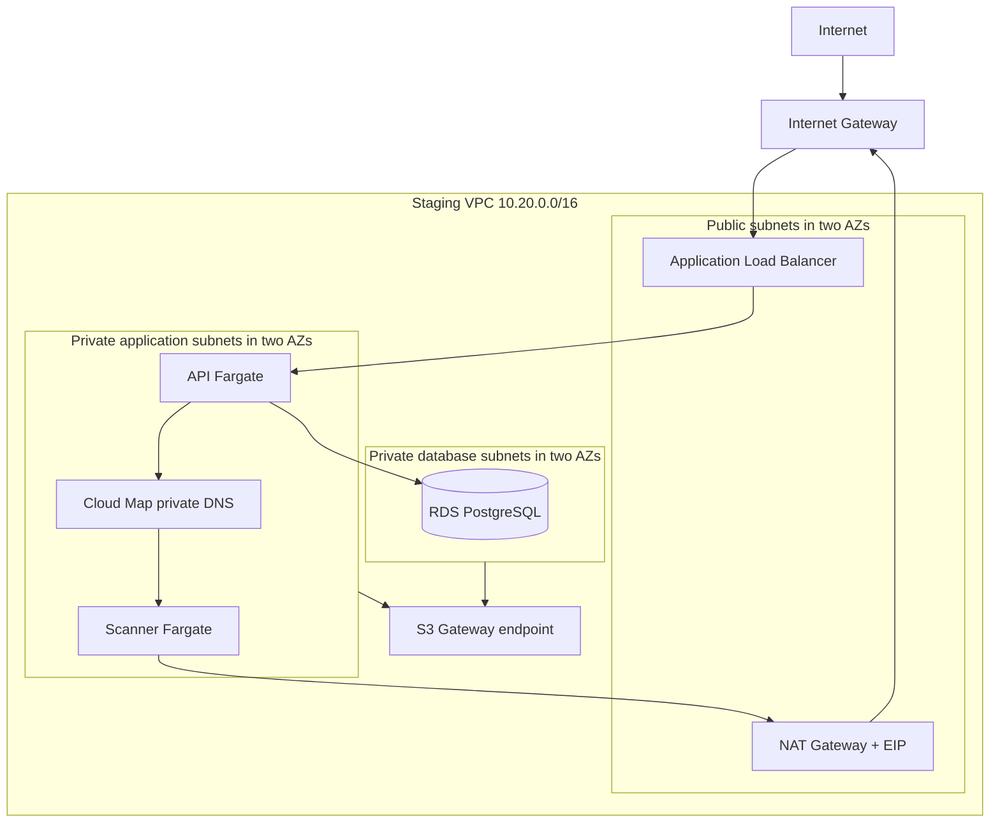

# Privacy Ready AWS Architecture

## System Overview

Privacy Ready currently implements one AWS staging environment. The architecture separates public delivery, Internet-facing API ingress, private application workloads, private data, and outbound-only website scanning.



`privacyready.co.uk` is the public homepage and anonymous scanner entry point. The current staging root manages `app-staging.privacyready.co.uk` for the browser application and `staging.privacyready.co.uk` for the API; it does not define a separate apex hosting stack.

## Request Flows

### Frontend Flow

```text
User -> Route53 -> CloudFront -> OAC-signed request -> private S3
```

CloudFront terminates TLS, caches static Vite assets, and maps S3 403/404 responses to `index.html` for client-side routing. S3 is not a website endpoint and cannot be read publicly.

### API Flow

```text
User -> Route53 -> WAF -> public ALB -> private API Fargate task:8080
```

The ALB is the only Internet-facing application compute endpoint. Port 80 redirects to HTTPS; port 443 uses ACM and forwards only to the API security group.

### Website Scanner Flow

```text
Browser -> API -> authenticated private scanner request -> Cloud Map scanner service
        -> NAT Gateway -> target public website
```

The browser sends the target to the API. The API attaches `X-Scanner-Api-Key` when calling `scanner.privacyready.local`; neither `SCANNER_API_KEY` nor that private hostname is included in browser responses or frontend bundles. The scanner validates every destination and redirect before connecting.

### Database Flow

```text
API security group -> TCP 5432 -> RDS security group -> PostgreSQL
```

RDS is encrypted, single-AZ for staging, placed only in database subnets, and not publicly accessible. No scanner, ALB, or Internet path can connect directly.

### Email Flow

Human and application mail deliberately use different systems:

```mermaid
flowchart LR
    IN[Internet mail] --> MX[privacyready.co.uk MX]
    MX --> NM[Names.co.uk mail hosting]
    NM --> HM[support / demo / staff mailboxes]
    API[Privacy Ready API] --> SES[Amazon SES]
    SES --> TX[no-reply@notify.privacyready.co.uk]
    TX --> C[Customer mailbox]
```

Names.co.uk hosts two-way human mail. SES sends verification, password-reset, team-invitation, and transactional application messages. The API role has only `SendEmail`/`SendRawEmail` on the verified transactional identity and a `ses:FromAddress` condition. No explicit Reply-To header is currently configured.

### Public Anonymous Scan Claim Flow



The raw claim token is cryptographically random, time-limited, single-use, and sent in a request body rather than a URL. Only its hash and expiry are stored. Claiming requires authentication; the server derives the organisation from the authenticated user, clears the token after one successful atomic update, and rejects expired, replayed, or already-owned claims.

## Network Architecture

The staging VPC is `10.20.0.0/16` across two available Availability Zones:

- two public `/24` subnets for the ALB and NAT Gateway routing
- two private application `/24` subnets for API and scanner Fargate tasks
- two private database `/24` subnets for RDS
- one Internet Gateway and one NAT Gateway with one Elastic IP
- an S3 Gateway endpoint associated with private application and database route tables
- one private Cloud Map DNS namespace, `privacyready.local`



Private application routes use the NAT Gateway for required outbound Internet access. Cloud Map is discoverable only inside the VPC.

## Security Groups

The intended graph is explicit:

| Group | Inbound | Outbound |
| --- | --- | --- |
| ALB | TCP 443 from Internet; TCP 80 from Internet for redirect only | TCP 8080 to API SG |
| API | TCP 8080 from ALB SG | TCP 8080 to scanner SG; TCP 5432 to RDS SG; TCP 443 to Internet |
| Scanner | TCP 8080 from API SG only | TCP 80 and 443 to Internet |
| RDS | TCP 5432 from API SG only | none |

Terraform creates security-group containers without inline rules. Every edge uses `aws_vpc_security_group_ingress_rule` or `aws_vpc_security_group_egress_rule`. This avoids conflicts between inline empty egress declarations and standalone rules, makes each trust edge reviewable, and removes AWS's default allow-all egress.

## Identity and IAM

API and scanner each have separate ECS execution and task roles:

- execution roles pull only from their exact ECR repository, write only to their log group, and retrieve only the required exact secret ARNs
- `ecr:GetAuthorizationToken` is the sole necessary wildcard resource action because AWS does not support repository scoping for it
- the API task role contains only scoped SES sending permissions
- the scanner task role has no application AWS permissions

The configuration does not grant `AdministratorAccess`, `ses:*`, or wildcard Secrets Manager access. ECS runtime verification reads task definitions and inline policies to enforce these contracts.

## Secret Architecture

| Secret | Source | API task | Scanner task |
| --- | --- | --- | --- |
| JWT secret | generated during rebuild, stored in Secrets Manager | yes | no |
| Scanner API key | generated during rebuild, stored in Secrets Manager | yes | yes |
| Stripe TEST secret key | supplied externally, stored in Secrets Manager | yes | no |
| Stripe webhook signing secret | supplied externally, stored in Secrets Manager | yes | no |
| RDS master password | generated and managed by RDS in Secrets Manager | JSON `password` key | no |

Terraform manages secret metadata, not application secret values. ECS obtains values during task startup through the execution roles. Secret rotation therefore requires a new task deployment or restart; running tasks do not automatically reload rotated values.

## Data Architecture

RDS PostgreSQL is the durable system of record. Storage is encrypted and network access is private. Prisma schema and committed migrations in `services/api/prisma/migrations` define database evolution.

Application records use organisation identifiers to enforce tenant ownership. Anonymous scans initially have no organisation. The authenticated claim operation assigns the organisation derived from the authenticated session, not client input. Scan history is consequently scoped by organisation. This document intentionally does not infer schema relationships beyond the repository implementation.

## Scanner Security

The scanner's primary boundary is network isolation: private subnet, no public IP, no load balancer, API-only ingress, and a shared API key checked with constant-time comparison. Application protections in `website_scanner.py` include:

- HTTP/HTTPS schemes only
- rejection of localhost, single-label/internal hostnames, loopback, RFC1918/private, link-local, reserved, multicast, unspecified, and metadata destinations through public-address validation
- rejection of IPv6 loopback and embedded URL credentials
- protected infrastructure domain rejection
- validation of all resolved addresses before connecting
- connection to a validated address while preserving the requested Host/SNI identity, limiting DNS rebinding opportunities
- revalidation after every redirect and a bounded redirect count
- a 5 MiB response limit checked both from `Content-Length` and while streaming
- anonymous API rate limiting in addition to general API/WAF rate controls

The committed scanner tests and live `verify` probes enforce these properties. Controls must not be relaxed to make an otherwise prohibited target scannable.

## Edge Security

The API ALB uses an ACM certificate, TLS 1.2/1.3 policy, HTTP-to-HTTPS redirect, invalid-header dropping, and regional WAF. WAF applies an IP rate rule plus AWS Managed Common, Known Bad Inputs, and Amazon IP Reputation rule groups. The API also applies route-level rate limits.

Credentialed CORS allows only configured frontend/marketing origins in production runtime; localhost development origins are added only outside production. Staging currently configures both permitted application origins to `https://app-staging.privacyready.co.uk`.

CloudFront uses a separate ACM certificate in `us-east-1`, redirects viewers to HTTPS, and requires TLS 1.2 or later.

## Frontend Security

The S3 origin has all four public-access-block controls enabled, bucket-owner-enforced ownership, AES-256 server-side encryption, and no public website hosting. CloudFront OAC signs every origin request, and the bucket policy allows `s3:GetObject` only for the exact distribution ARN.

The SPA contains public configuration such as `VITE_API_URL`, never backend credentials. Build and verification steps scan output and responses for the scanner key name and private Cloud Map hostname. One-time scan claim tokens stay in same-tab `sessionStorage` and POST bodies rather than URLs/referrers.

## DNS Architecture

Names.co.uk remains the registrar. Its domain delegation identifies Route53 as authoritative DNS:

```text
Names.co.uk registrar -> four new Route53 nameservers -> hosted-zone records
```

The Route53 bootstrap root owns the public hosted zone. The staging root adds application aliases, ACM validation, and transactional SES records. Operator-supplied apex MX/SPF/DKIM records continue to direct human mail to Names.co.uk. SES Easy DKIM is under `notify.privacyready.co.uk`; its custom MAIL FROM/SPF boundary is `mail.notify.privacyready.co.uk`, so it cannot overwrite apex human-mail SPF. Transactional DMARC begins at `p=none`. Registrar delegation and zone records are different layers; changing one does not repair the other.

## Environments

Only staging is implemented and supported by the current rebuild workflow. The active root is `terraform/environments/staging`; reusable components are under `terraform/modules`. That module layout can support deliberate future environment work, but no production environment is created or implied by this documentation.

## Cost Architecture

The principal continuous staging costs are the NAT Gateway and processed data, ALB, RDS instance/storage, API and scanner Fargate tasks, and WAF. CloudFront and data transfer vary with use. Route53 and the versioned backend bucket are relatively inexpensive but not free.

The default API desired count is one in generated staging variables and the scanner default is one. Scanner desired count directly changes Fargate cost; setting it to zero also disables scanning and its running-task alarm.

## Security Boundaries

- Internet to AWS edge: Route53, TLS, WAF, and ALB/CloudFront accept public traffic.
- CloudFront to S3: OAC-signed, read-only access to a non-public bucket.
- ALB to API: a single SG-to-SG path on port 8080.
- API to scanner: private Cloud Map discovery, SG-to-SG path, and scanner API-key authentication.
- API to RDS: SG-to-SG PostgreSQL path; database credentials arrive through ECS secret injection.
- API to SES: least-privilege task-role actions, domain identity, and sender condition.
- Scanner to Internet: outbound-only NAT path after destination validation; no inbound Internet route.
