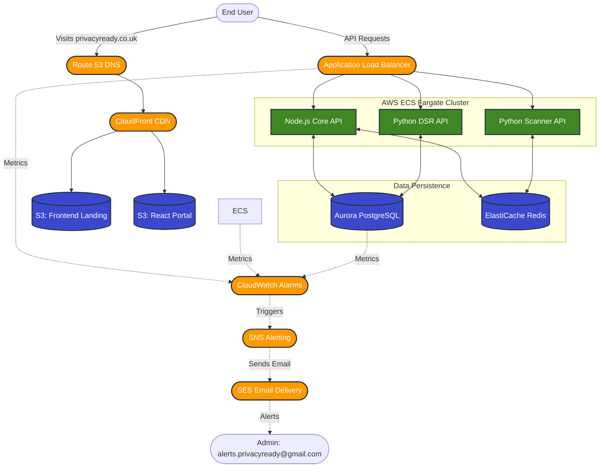
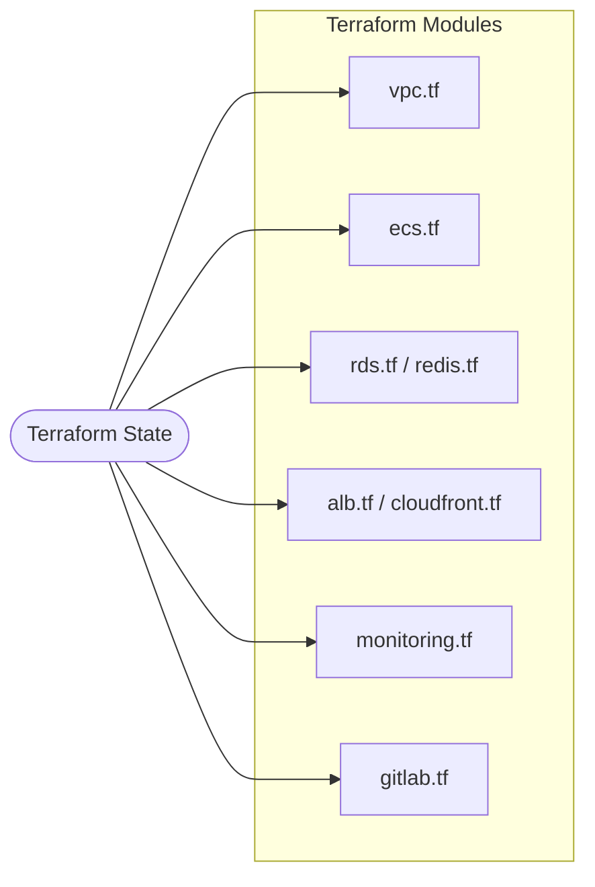

# PrivacyReady Platform - System Architecture & Overview

PrivacyReady is a comprehensive GDPR (Personal Data Protection Act) compliance platform tailored for the Thai market. It provides automated website and social media scanning, consent management, data subject rights (DSR) workflows, and infrastructure blueprints designed specifically for strict data residency and security compliance.

---

## 🏛️ System Architecture

The PrivacyReady platform is built using a microservices architecture and deployed entirely on **AWS (Amazon Web Services)**. This ensures high availability, strict data residency within the Asia Pacific region, and enterprise-grade security.

### Core AWS Infrastructure

---

## 📦 Component Breakdown

### 1. Static Frontend & Portals (AWS S3 + CloudFront)
- **Landing Page (`frontend/index.html`)**: A static, trilingual (EN, TH, RU) frontend hosting the Free GDPR Scanner UI. It includes a **mandatory, cross-domain cookie consent wall** that blocks site functionality until cookies are accepted.
- **Client Portal (`frontend/portal`)**: A React-based Single Page Application (SPA) for authenticated users to manage their compliance workflows.
- **Deployment**: Both are hosted securely in private AWS S3 buckets. Public access is facilitated exclusively through CloudFront distributions using Origin Access Identities (OAI) for caching, low latency, and SSL/TLS termination.

### 2. Backend Microservices (AWS ECS Fargate)
All backend services are dockerized, pushed to AWS Elastic Container Registry (ECR), and run as serverless containers on **AWS ECS Fargate**.
- **Core API Service (`services/api`)**: Written in Node.js (Fastify). Handles authentication, core business logic, user consent tracking, and proxies requests to other microservices.
- **Scanner Service (`services/scanner`)**: Written in Python (FastAPI). Performs deep GDPR compliance checks on user infrastructure (Websites, Facebook, LINE, TikTok) and aggregates risks into a compliance score.
- **DSR Service (`services/dsr`)**: Written in Python (FastAPI). Manages Data Subject Rights (DSR) workflows, such as automated data deletion and access requests.

### 3. Data Storage (AWS RDS & ElastiCache)
- **Primary Database**: Amazon Aurora PostgreSQL (`db.t3.medium`). Used for storing user profiles, scan histories, and DSR records.
- **Caching & Message Broker**: Amazon ElastiCache (Redis 7.0). Used for rate limiting, session management, and asynchronous task queues between the Core API and the Scanner service.

### 4. Monitoring & Alerting (CloudWatch, SNS, SES)
The entire infrastructure is continuously monitored for health and performance anomalies:
- **CloudWatch Alarms**: Triggers on critical events such as high CPU utilization, high memory usage, ALB 5xx error spikes, or low RDS storage capacity.
- **Route 53 Health Checks**: Constantly ping the API endpoints to ensure uptime.
- **Alert Routing**: Alarms publish messages to an **Amazon SNS** topic, which in turn leverages **Amazon SES** to send formatted email notifications directly to `alerts.privacyready@gmail.com`.

---

## 🔒 Security & Data Residency (GDPR Compliance)

To comply with Thailand's GDPR requirements regarding cross-border data transfers and security:

1. **Geographic Data Residency**: All production data, including S3 buckets, RDS clusters, and ECS containers, are strictly provisioned in AWS `eu-west-2` (London) to maintain UK GDPR data sovereignty.
2. **Encryption**: 
   - **In Transit**: All endpoints are secured with modern TLS v1.2+ via AWS ACM certificates. HTTP traffic is strictly redirected to HTTPS at the Load Balancer level.
   - **At Rest**: EBS volumes, RDS clusters, ElastiCache, and S3 buckets are encrypted using AWS Key Management Service (KMS).
3. **Network Isolation**: Resources are deployed within isolated Virtual Private Clouds (VPCs). Databases and internal services are located in private subnets with absolutely no direct internet access, relying on NAT Gateways for outbound traffic and ALBs for inbound routing.

---

## 🛠️ Infrastructure as Code (Terraform)

The entire AWS environment is codified using Terraform, ensuring reproducible, version-controlled infrastructure deployments. 

### Terraform Workspaces (Cost Optimization)
The infrastructure is designed to be highly cost-optimized across environments using **Terraform Workspaces**:
- **Production Workspace (`production`)**: Deploys a highly available, multi-AZ architecture with dedicated VPCs (Management, Staging, Production) interconnected via a Transit Gateway, alongside multi-node Aurora clusters and ElastiCache replication groups.
- **Testing Workspace (`testing`)**: Deploys a consolidated, low-cost environment. It collapses all networks into a single VPC, provisions single-node databases, and disables non-essential EC2 instances to radically minimize AWS billing during development and testing.

### Ansible Automation (Zero-Touch Updates)
EC2 instances (such as the GitLab server) are configured dynamically using **Ansible** playbooks retrieved during boot via EC2 `user_data`. 
- **Zero-Touch Patching**: The platform includes a universal patch management playbook (`ansible/patch-linux.yml`) that dynamically utilizes OS facts to execute system updates (`apt`, `yum`, or `dnf`) and handle safe reboots across mixed OS fleets without manual intervention.

### Self-Hosted GitLab (CI/CD)
The infrastructure blueprints include a fully isolated, self-hosted GitLab instance deployed on a private EC2 instance. This instance handles:
- Version Control for strict internal code governance.
- Automated CI/CD pipelines to build Docker images and push them directly to ECR.
- *Note:* The production application (ECS, API, RDS) runs completely independent of GitLab. The SaaS remains online even if the GitLab instance is shut down to save costs.

#### Least Privilege CI/CD Pipeline Configuration
To ensure maximum security, the CI/CD pipelines do not use root or administrator AWS keys. Instead, Terraform provisions a dedicated, strict **least-privilege IAM user** (`gitlab-ci-deployer`). This user only has permission to:
- Authenticate to Elastic Container Registry (ECR).
- Push images *only* to the three specific PrivacyReady microservice repositories.
- Trigger `UpdateService` *only* on the specific PrivacyReady ECS services.

**How to retrieve CI/CD credentials:**
The access keys for this user are automatically generated and stored securely in AWS Secrets Manager. To configure your GitLab CI/CD Variables:
1. Go to the AWS Secrets Manager console.
2. Locate the secret named `privacyready/gitlab/ci-credentials`.
3. Copy the `AWS_ACCESS_KEY_ID` and `AWS_SECRET_ACCESS_KEY` into your GitLab Project's CI/CD Settings.

---

## 📂 Documentation Directory Reference

- `docs/01_AWS_Thailand_GitLab_Architecture.md`: AWS infrastructure and GDPR justification.
- `docs/02_GitHub_GDPR_SCC_Documentation.md`: GitHub Standard Contractual Clauses (SCC) for cross-border code hosting.
- `docs/03_Route53_ACM_CloudFront_Setup_Guide.md`: Frontend S3/CloudFront deployment guide.
- `docs/production_system_architecture.md`: In-depth multi-VPC architecture diagrams and specifications for the production environment.
- `docs/social-scanner.md`: Threat models and API specs for the social media scanners.
- `docs/validation-report.md`: Automated testing and QA sign-offs.
