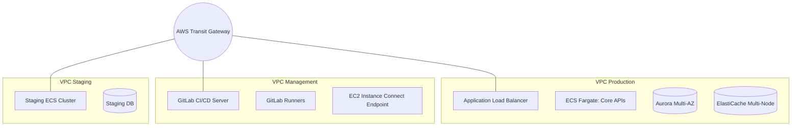
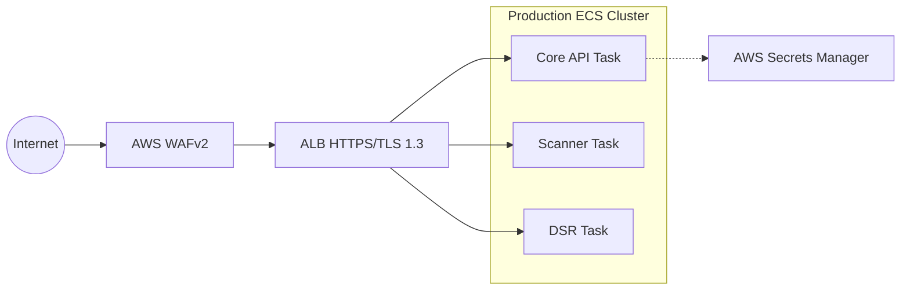
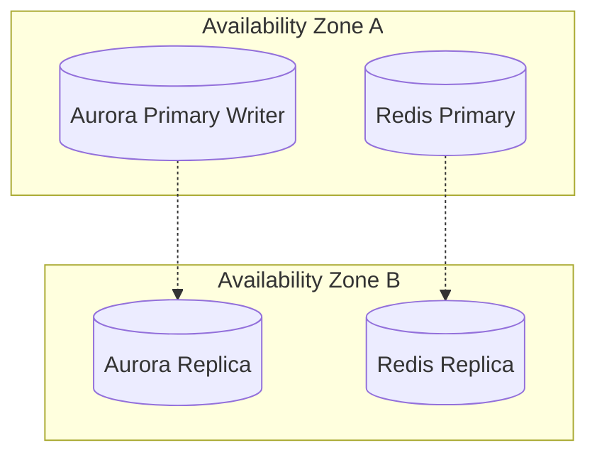
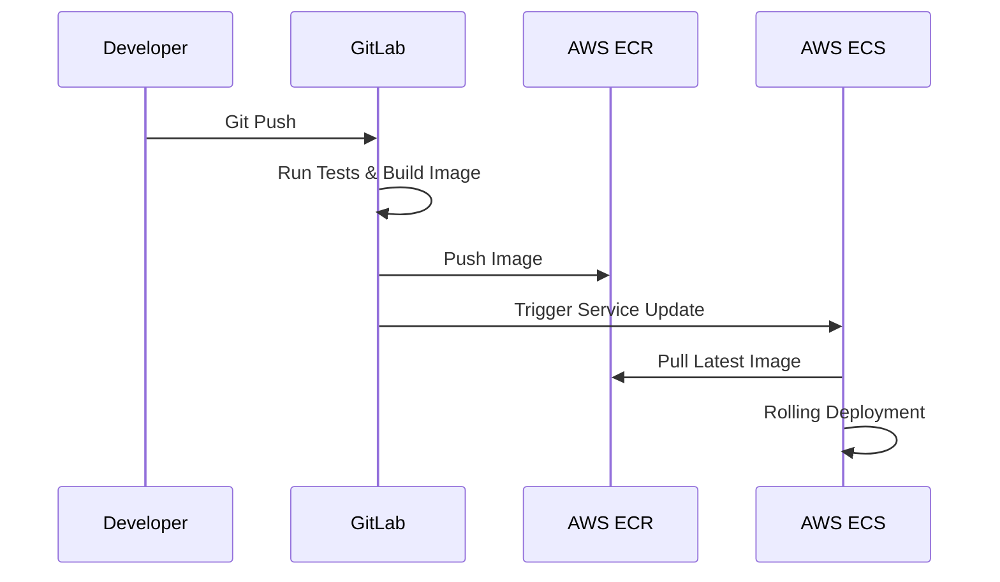

# Production System Architecture

> **Note on accuracy**: this doc describes the production environment's
> networking topology accurately (multi-VPC via Transit Gateway is
> real and unchanged by the persistent/environments refactor -- see
> `terraform/README.md`). The database section below describing
> Amazon Aurora is **not** accurate to the actual implementation,
> which uses a single `aws_db_instance` (plain RDS PostgreSQL,
> Multi-AZ) rather than Aurora's writer/reader replica architecture --
> this mismatch predates the persistent/environments refactor, not
> introduced by it. Worth either building real Aurora to match this
> doc, or rewriting this section to match the simpler reality.

The PrivacyReady Production Environment (`terraform/environments/production`) is a highly available, deeply isolated, and scalable architecture designed for enterprise-grade GDPR compliance. Unlike the consolidated testing environment, the production environment heavily utilizes network segmentation to separate management tools from user-facing services.

---

## 1. Multi-VPC Network Topology

The production architecture is segmented into three distinct Virtual Private Clouds (VPCs) connected centrally via an **AWS Transit Gateway**.

### Network Rules
- **No Peering**: VPCs do not peer directly with one another. All traffic routes through the Transit Gateway to allow for centralized flow logging and future firewall insertion.
- **Private by Default**: All databases and application containers live in private subnets. Only the Application Load Balancer (ALB) and NAT Gateways reside in public subnets.

---

## 2. Application & Compute Layer

The application is hosted entirely on serverless **AWS ECS (Elastic Container Service) on Fargate**.

### Key Components
- **AWS WAF**: Automatically blocks requests from non-approved countries (Geo-blocking) and enforces strict rate limiting to prevent DDoS and brute-force attacks.
- **Application Load Balancer**: Terminates SSL/TLS. It redirects all port 80 traffic to port 443.
- **Auto Scaling**: All ECS services have Target Tracking Scaling policies attached, automatically spinning up new containers if CPU or Memory utilization exceeds 70%.

---

## 3. Data & Persistence Layer

Data persistence is handled by highly available, managed AWS services spanning multiple Availability Zones (AZs).

### Key Components
- **Amazon Aurora PostgreSQL**: Provisioned with a minimum of 2 instances (1 Writer, 1 Reader) to ensure immediate failover without data loss.
- **Amazon ElastiCache (Redis)**: Deployed as a Replication Group across multiple AZs to cache high-velocity consent requests and queue background scanner tasks.
- **KMS Encryption**: All EBS volumes, RDS instances, and Redis clusters are strictly encrypted at rest using a dedicated customer-managed AWS KMS key.

---

## 4. GitLab CI/CD Pipeline

Code is deployed natively using a self-hosted GitLab instance located in the Management VPC.

### Security & Patching
- **Zero-Touch Updates**: The GitLab EC2 instance and its Runners are managed dynamically using Ansible. An automated `patch-linux.yml` playbook runs regularly to execute system updates (via `dnf`) and handle safe reboots without human intervention.
- **Least Privilege Deployments**: The GitLab pipeline utilizes a specific IAM user (`gitlab-ci-deployer`) that only holds permissions to push to ECR and execute `UpdateService` on ECS. It cannot modify infrastructure.
