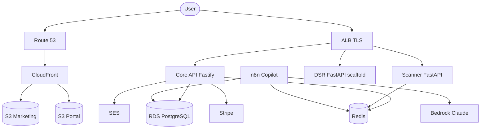

# TECH — Technical Design Document (TDD)

> The bible for PrivacyReady tech decisions

---

## Tech stack

| Layer | Choice | Notes |
|-------|--------|-------|
| Marketing site | Plain HTML / CSS / JS | No build step; `frontend/` |
| Portal | React 19 + Vite + TypeScript | `frontend/portal/` |
| Core API | Node.js + Fastify 5 + TypeScript | `services/api/` |
| ORM | Prisma 5 → PostgreSQL | `services/api/prisma/schema.prisma` |
| Scanner | Python + FastAPI | `services/scanner/` |
| DSR service | Python + FastAPI (scaffold) | Persistence lives in Core API today |
| IaC | Terraform | `terraform/persistent` + `environments/{test,production}` + modules |
| CI/CD | Self-hosted GitLab | `.gitlab-ci.yml` + `Makefile` |
| Containers | Docker → ECR → ECS Fargate | |

---

## Tools & services

| Tool | Role |
|------|------|
| AWS ECS Fargate | API, Scanner, DSR, n8n tasks |
| Amazon RDS PostgreSQL | Primary app data |
| ElastiCache Redis 7 | Rate limit, sessions, scanner queues |
| Application Load Balancer | TLS terminate, path/host routing |
| CloudFront + S3 | Marketing site + portal static hosting |
| Route 53 | DNS + health checks (`eu-west-2`) |
| ACM | TLS certificates |
| Secrets Manager | DB, JWT, Stripe, CI credentials |
| SES | Verification, invites, alerts |
| SNS + CloudWatch | Alarms → email |
| Stripe | Subscriptions / Checkout / webhooks |
| AWS Bedrock (Claude) | n8n Compliance Copilot (optional) |
| n8n | Workflow automation / AI copilot |
| WAFv2 | Geo / rate protections (production) |
| KMS | Encryption at rest |

---

## APIs & integrations

### Core API (`services/api`) — prefix `/api` unless noted

| Area | Endpoints |
|------|-----------|
| Health | `GET /health` |
| Auth | `POST /auth/register`, `/verify-email`, `/resend-verification`, `/login`, `/logout`, `GET /auth/me`, `/forgot-password`, `/reset-password`, `/change-password` |
| Scans | `POST /api/public/scan`, `GET|POST /api/scan`, `DELETE /api/scan/:id` |
| DSR | `GET|POST /api/dsr`, `PATCH /api/dsr/:id` |
| Team | `GET|POST /api/team`, `DELETE /api/team/:id` |
| Admin | `GET /admin/stats`, `/admin/users`, `/admin/organizations`, `PATCH|DELETE /admin/users/:id`, `DELETE /admin/organizations/:id` |
| Billing | `GET /billing/subscription-status`, `POST /billing/create-checkout-session`, `/verify-session`, `/webhook` |
| Consent | `GET|POST /api/v1/consents` (stub) |

Auth: JWT (`@fastify/jwt`), bcrypt passwords, SHA-256 hashed email-verify / claim tokens. Rate limiting via `@fastify/rate-limit` + Redis where configured.

### Scanner (`services/scanner`)

| Endpoint | Purpose |
|----------|---------|
| `GET /health` | Liveness |
| `POST /v1/scan/website` | Website GDPR crawl (API key) |
| `POST /v1/scan/social` | Social / CRM platform scans (API key) |

Platform scanners: website, Facebook, Instagram, LinkedIn, TikTok, WhatsApp, Twitter, Mailchimp, Google Analytics 4 — scored by a unified risk engine.

### External integrations
- **Stripe** — Checkout sessions + subscription webhooks
- **SES** — transactional email from `noreply@…`
- **Bedrock** — Claude via private VPC endpoint (n8n only)

---

## Architecture overview

**Environments**
- `terraform/persistent` — GitLab, DNS, SES, ACM, ECR (long-lived)
- `terraform/environments/test` — disposable low-cost stack
- `terraform/environments/production` — multi-AZ, WAF, segmented VPCs via Transit Gateway

---

## Key tech decisions

| Decision | Why |
|----------|-----|
| UK `eu-west-2` only | UK GDPR data residency; no merge with DataWai / Thailand |
| Fastify + Prisma for Core API | Typed routes, fast DX, single source of truth for schema |
| DSR persistence in Node API (not Python service yet) | Python DSR is a scaffold; avoid dual-write until ownership is decided |
| JWT in localStorage (portal) | Simple SPA auth; server re-checks role on every `/admin/*` call |
| `prisma db push` (no migration history yet) | Repo has no migrate history; fail loudly on destructive schema drift |
| SUPERADMIN via env (`SUPERADMIN_EMAIL`) | No hardcoded admin email in a public repo |
| Anonymous scan claim tokens | Scan IDs alone are not ownership proof (shareable URLs / referrers) |
| Stripe subscriptionStatus on Organization | Org-level gating for paywall / premium modules |
| Separate Terraform states | Destroying test/prod cannot touch GitLab / DNS / SES |
| Fail-fast without `JWT_SECRET` / DB creds | Prevent silent insecure boots |

---

## Security baseline

- TLS 1.2+ everywhere; HTTP → HTTPS at ALB
- Encryption at rest (KMS) on RDS, Redis, S3, EBS
- Private subnets for DB / ECS; NAT for egress
- Helmet + CORS on Fastify
- Least-privilege `gitlab-ci-deployer` IAM user for deploys
- Secrets only via Secrets Manager / Terraform vars (never committed `.tfvars` with secrets)
