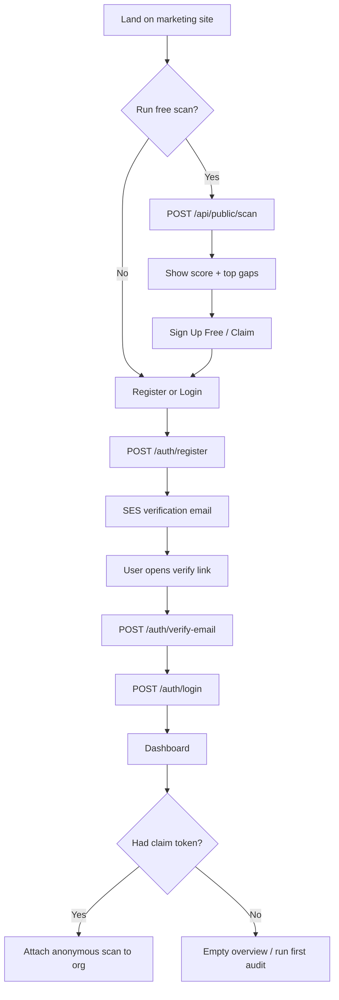
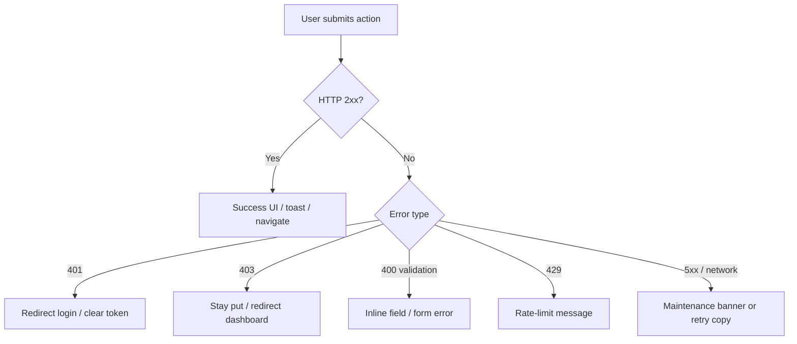

# FLOW — App & User Flows

> Onboarding, screens, journeys, actions, success / error states

---

## Screens

### Marketing (`privacyready.co.uk`)
| Screen | File | Purpose |
|--------|------|---------|
| Home + free scanner | `frontend/index.html` | Hero scan widget, services, pricing, CTA |
| About / Contact / FAQ | `about.html`, `contact.html`, `faq.html` | Trust & support |
| Privacy / Terms / Cookies | `privacy-policy.html`, `terms.html`, `cookies.html` | Legal (draft) |
| Coming soon | `coming-soon.html` | Unbuilt features (API Access, Fine Calculator, etc.) |

### Portal (`portal.privacyready.co.uk`)
| Route | Screen | Auth |
|-------|--------|------|
| `/login` | Login | Public |
| `/register` | Register (+ plan query) | Public |
| `/verify-email` | Email verification | Public (token) |
| `/blog`, `/blog/:slug` | Blog | Public |
| `/dashboard` | Main compliance dashboard (tabbed) | JWT |
| `/team` | Org team management | JWT (ADMIN+) |
| `/admin` | Platform admin | JWT SUPERADMIN |

### Dashboard tabs (authenticated)
Overview · Past Audits · DSR Manager · Policy Generator · Consent Manager · Vendors & RoPA · Breach Register · Staff Training · Integrations · Certificate · Settings

---

## Onboarding

**Rules**
- Registration creates an *unverified* user — no session token until verify
- Login rejects unverified accounts
- Optional `?plan=starter-founding|growth-founding` on register feeds Stripe Checkout later

---

## User journeys

### 1. Free scan → paid conversion
1. Enter website URL (+ optional social / GA4 / Mailchimp fields)
2. Instant preview score (blurred deep findings for free)
3. CTA → register → verify → dashboard
4. Stripe Checkout (Starter / Growth) unlocks full findings + modules

### 2. Authenticated deep audit
1. Dashboard → New audit → choose type + target
2. `POST /api/scan` → Core API proxies / queues Scanner
3. Poll / refresh → score, checks, remediation tasks
4. Export / print / mark remediations complete

### 3. Data subject request (DSR)
1. DSR Manager → create request (type + subject email + due date)
2. Status: Pending → In Progress → Completed
3. Org-scoped; GDPR 30-day clock reflected in `dueDate`

### 4. Team invite
1. Org ADMIN opens `/team` → add email + name
2. API creates user with temp password + SES invite
3. Teammate verifies email, may be forced to change password
4. ADMIN can remove seats

### 5. Platform admin
1. User with `SUPERADMIN` (email matches `SUPERADMIN_EMAIL` at register) opens `/admin`
2. View stats, promote/demote roles, delete users/orgs
3. Client-side role gate is UX only — API enforces SUPERADMIN

### 6. Maintenance
- Portal polls `GET /health`; 502/503/504 shows global maintenance banner

---

## Button actions (key)

| UI action | API / effect |
|-----------|----------------|
| Check Free (marketing) | `POST /api/public/scan` |
| Sign Up Free | Navigate register (+ claim token in storage if present) |
| Verify email | `POST /auth/verify-email` |
| Log in | `POST /auth/login` → store JWT → `/dashboard` |
| Log out | Clear JWT → `/login` |
| Run audit | `POST /api/scan` |
| Delete audit | `DELETE /api/scan/:id` |
| Create / complete DSR | `POST /api/dsr`, `PATCH /api/dsr/:id` |
| Invite teammate | `POST /api/team` |
| Remove teammate | `DELETE /api/team/:id` |
| Upgrade / subscribe | `POST /billing/create-checkout-session` → Stripe |
| Accept cookies | Local consent flag; gates analytics (`hasAnalyticsConsent`) |

---

## Success / error states

| Flow | Success | Error |
|------|---------|-------|
| Register | "Check your email" screen | Duplicate email / validation |
| Verify | Confirmed → login | Invalid/expired token |
| Login | Dashboard | Wrong password / unverified |
| Free scan | Score card | Invalid URL / scanner down |
| Checkout | `subscriptionStatus=active` | Stripe cancel / webhook miss |
| Team invite | Temp password shown + email sent | Non-ADMIN / SES sandbox failure |

Cookie consent wall on marketing + portal `CookieConsent` component must be acknowledged before analytics/storage beyond essentials.
