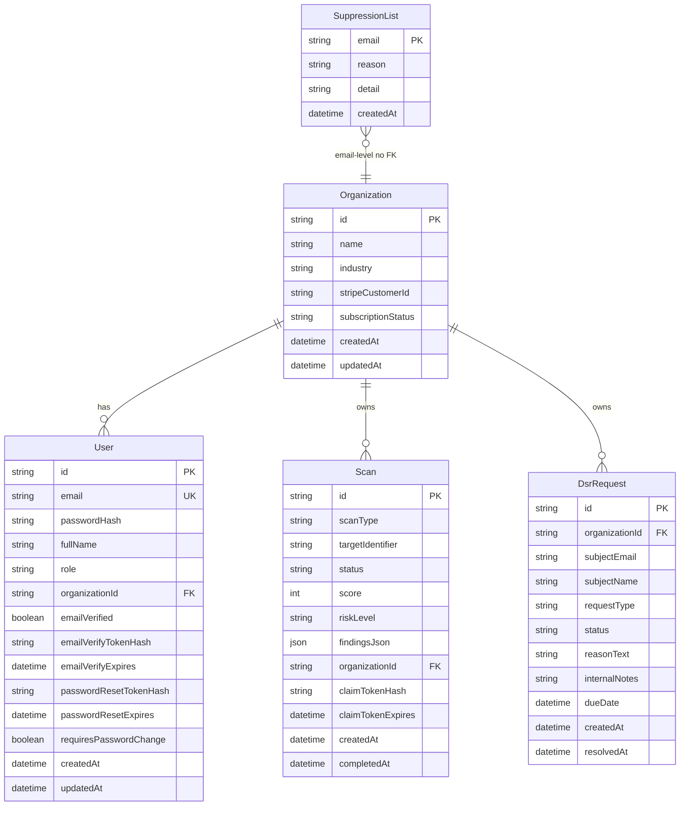

# SCHEMA — Backend Database Schema

> Source of truth: `services/api/prisma/schema.prisma` (PostgreSQL on Amazon RDS)

---

## Legend

| Symbol | Meaning |
|--------|---------|
| **PK** | Primary key |
| **FK** | Foreign key |
| **UQ** | Unique |
| `1 — *` | One-to-many |
| Timestamps | `createdAt` / `updatedAt` / domain-specific |

All IDs are UUID strings unless noted.

---

## Entity relationship overview

---

## Tables

### Organization
| Column | Type | Notes |
|--------|------|-------|
| id | UUID PK | |
| name | TEXT | Company / org display name |
| industry | TEXT? | Optional |
| stripeCustomerId | TEXT? | Stripe customer linkage |
| subscriptionStatus | TEXT | `free` (default), `active`, `past_due`, `canceled` |
| createdAt / updatedAt | TIMESTAMP | |

**Relations:** `users[]`, `scans[]`, `dsrRequests[]`

### User
| Column | Type | Notes |
|--------|------|-------|
| id | UUID PK | |
| email | TEXT UQ | Login identity |
| passwordHash | TEXT | bcrypt |
| fullName | TEXT | |
| role | TEXT | Default `MEMBER`; also `ADMIN`, `SUPERADMIN` |
| organizationId | UUID FK → Organization | Cascade delete |
| emailVerified | BOOLEAN | Default false |
| emailVerifyTokenHash | TEXT? | SHA-256 of emailed token — never store raw |
| emailVerifyExpires | TIMESTAMP? | |
| passwordResetTokenHash | TEXT? | |
| passwordResetExpires | TIMESTAMP? | |
| requiresPasswordChange | BOOLEAN | Team invite / temp password flow |
| createdAt / updatedAt | TIMESTAMP | |

### Scan
| Column | Type | Notes |
|--------|------|-------|
| id | UUID PK | |
| scanType | TEXT | Website / social / CRM variants |
| targetIdentifier | TEXT | URL, page id, property id, etc. |
| status | TEXT | Default `PENDING` |
| score | INT? | Compliance score when complete |
| riskLevel | TEXT? | |
| findingsJson | JSON? | Checks, logs, remediation payload |
| organizationId | UUID? FK → Organization | Null for anonymous public scans; cascade when set |
| claimTokenHash | TEXT? | Proves ownership for anonymous → org claim |
| claimTokenExpires | TIMESTAMP? | |
| createdAt | TIMESTAMP | |
| completedAt | TIMESTAMP? | |

### DsrRequest
| Column | Type | Notes |
|--------|------|-------|
| id | UUID PK | |
| organizationId | UUID FK → Organization | Cascade; indexed with status |
| subjectEmail | TEXT | Data subject |
| subjectName | TEXT? | |
| requestType | TEXT | `ACCESS`, `ERASURE`, `RECTIFICATION`, `PORTABILITY`, `RESTRICTION` |
| status | TEXT | `PENDING`, `IN_REVIEW`, `APPROVED`, `REJECTED`, `COMPLETED` |
| reasonText | TEXT? | |
| internalNotes | TEXT? | Staff-only |
| dueDate | TIMESTAMP | GDPR response deadline (e.g. 30 days) |
| createdAt | TIMESTAMP | |
| resolvedAt | TIMESTAMP? | |

**Index:** `(organizationId, status)`

### SuppressionList
| Column | Type | Notes |
|--------|------|-------|
| email | TEXT PK | Suppressed recipient |
| reason | TEXT | `BOUNCE`, `COMPLAINT` |
| detail | TEXT? | Bounce subtype / diagnostic |
| createdAt | TIMESTAMP | SES bounce/complaint handling |

---

## Relationships

| From | To | Cardinality | FK |
|------|-----|-------------|-----|
| Organization | User | 1 — * | `User.organizationId` |
| Organization | Scan | 1 — * | `Scan.organizationId` (nullable for public) |
| Organization | DsrRequest | 1 — * | `DsrRequest.organizationId` |
| — | SuppressionList | standalone | Email PK (no org FK) |

---

## Notes for AI agents / implementers

- There is **no** Prisma migration history yet — schema is applied with `prisma db push`.
- Consent records are **not** fully modeled in Prisma today (`/api/v1/consents` is a stub); portal consent UI is mostly client-side / future Growth module.
- Dashboard entities such as BreachIncident, VendorRecord, RoPA, StaffTraining are largely **UI-state / local** in the current portal unless wired to new tables — do not invent FKs that are not in Prisma.
- n8n may use a **separate** optional RDS instance (`create_n8n_rds`); not part of this app schema.
- Redis is used for queues/rate limits — **not** a relational schema here.
