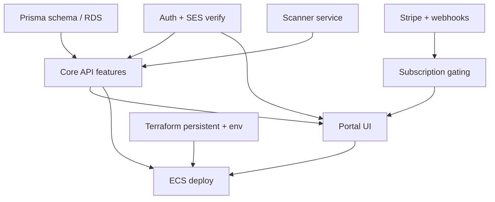

# PLAN — Engineering Plan

> Goal · Team · Timeline · Metrics · Small tasks · Dependencies · Build order · Acceptance criteria

---

## Goal

Ship and harden PrivacyReady as a UK-only GDPR compliance SaaS: free marketing scans, authenticated portal audits, DSR/ops tooling, Stripe billing, and AWS `eu-west-2` infrastructure that can be destroyed/recreated without losing GitLab/DNS/SES.

---

## Team (roles)

| Role | Owns |
|------|------|
| Product / founder | Pricing, positioning, founding-member caps |
| Backend | Fastify API, Prisma, Stripe, SES, scan orchestration |
| Scanner | FastAPI website + social scanners + scoring |
| Frontend | Marketing site + React portal UX |
| Infra / DevOps | Terraform states, ECS, CI/CD, cost-saver teardown |
| Compliance advisor (external) | Solicitor review of legal pages (outstanding) |

---

## Timeline (suggested phases)

| Phase | Focus | Outcome |
|-------|-------|---------|
| 0 — Foundation | Persistent Terraform, ECR, DNS, SES, secrets | Account bootstrappable (`docs/BOOTSTRAP.md`) |
| 1 — Core path | Auth verify, public scan claim, authenticated scans | Free → register → dashboard works |
| 2 — Compliance ops | DSR API + portal, breach/policy UX | Paid Starter value prop |
| 3 — Growth modules | Consent, vendors/RoPA, training, seats | Growth plan unlocks |
| 4 — Hardening | SES production, monitoring, bug backlog | Production-ready ops |
| 5 — Copilot | n8n + Bedrock workflows | AI-assisted remediation / DSR drafts |

Exact calendar dates depend on founding-beta burn-down; treat phases as dependency-ordered milestones.

---

## Metrics

| Metric | Target signal |
|--------|----------------|
| Free scan completion rate | Visitors finish preview without error |
| Verify → first login | Verification emails deliver (SES out of sandbox) |
| Scan claim success | Anonymous scans attach to org |
| Paid conversion | Free → Starter/Growth Checkout completed |
| DSR SLA | Requests resolved before `dueDate` |
| API health | `/health` green; low ALB 5xx |
| UK residency | No resources outside `eu-west-2` for customer data |

---

## Small tasks (current backlog themes)

Drawn from `PR_SUMMARY.md`, bug lists, and known gaps:

1. Confirm `SUPERADMIN_EMAIL` / `TF_VAR_superadmin_email` set before deploy
2. Request SES production access; verify bounce → SuppressionList path
3. Decide fate of `services/dsr` Python scaffold (retire vs give real job)
4. Persist breach / vendor / RoPA / training if they must survive refresh (schema + API)
5. Replace remaining `alert()` error UX with inline portal errors
6. Wire consent manager beyond stub `/api/v1/consents`
7. Solicitor review of privacy policy & terms (remove draft banners)
8. Empty-state / layout polish after color retint
9. Cost-saver runbooks exercised on test env (`make teardown` / `startup`)
10. Close dashboard/frontend bugs tracked in `*-bugs.txt` / GitLab CSV imports

---

## Dependencies

- **Auth** blocks meaningful portal work and team invites  
- **Scanner** blocks audit value  
- **Stripe** blocks paywall unlock  
- **Terraform / secrets** block any environment deploy  
- **SES sandbox** blocks real-world email until production access  

---

## Build order

1. **Setup** — AWS account bootstrap, persistent stack, env stack, secrets (`JWT_SECRET`, DB, Stripe, `SUPERADMIN_EMAIL`)
2. **Backend** — Prisma schema, auth, public/authenticated scan, DSR, team, admin, billing webhooks
3. **Frontend** — Marketing scanner widget, portal auth + dashboard tabs, paywall, admin/team
4. **Deploy** — ECR images, ECS services, CloudFront invalidation, smoke `/health` + register/login/scan

Optional later: n8n/Bedrock copilot, standalone consent service, Python DSR ownership.

---

## Acceptance criteria

### Works as expected
- [ ] Free scan returns score; claim token survives register
- [ ] Unverified users cannot login; verified users reach dashboard
- [ ] Authenticated scan creates org-scoped `Scan` rows with findings
- [ ] DSR create/list/update is org-scoped and persisted
- [ ] Stripe Checkout sets `subscriptionStatus=active` and lifts paywall
- [ ] SUPERADMIN-only `/admin`; org ADMIN can manage `/team`

### No errors
- [ ] API refuses to boot without `JWT_SECRET` / DB credentials
- [ ] No hardcoded admin emails or DataWai contamination in user-facing copy
- [ ] Terraform destroy of test/prod cannot delete persistent GitLab/DNS/SES

### Meets requirements
- [ ] Customer data residency `eu-west-2`
- [ ] TLS everywhere; secrets not in git
- [ ] Pricing/features match marketing Starter vs Growth matrix

### Tests added
- [ ] CI lint/build for API + portal
- [ ] Smoke path documented or scripted (register → verify → scan)
- [ ] Critical security regressions covered (authz on admin/team/dsr)

---

## How to use this pack with an AI agent

Feed these six docs together before asking an agent to build or change features:

1. `01-PRD.md` — what / why  
2. `02-TECH.md` — how / stack  
3. `03-FLOW.md` — journeys  
4. `04-DESIGN.md` — visual system  
5. `05-SCHEMA.md` — data model  
6. `06-PLAN.md` — this file — order and done-when  

Prefer codebase paths cited here over inventing parallel services or schemas.
